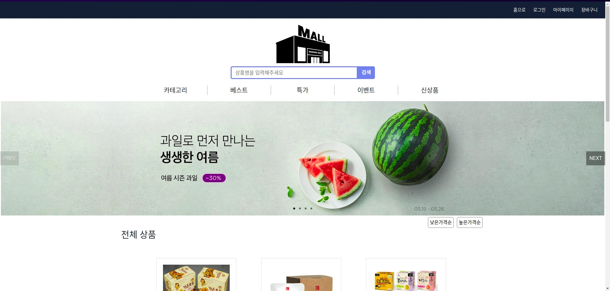
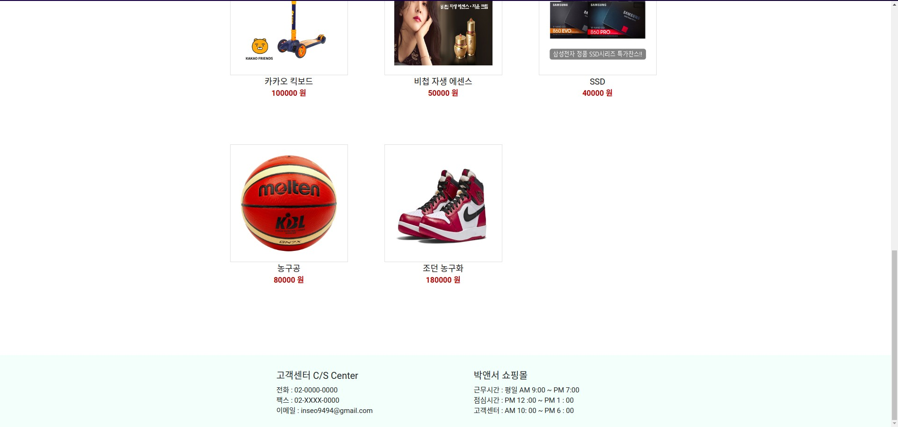

# Online Shopping Mall(front)

온라인 쇼핑몰 Web Application

[링크](http://answer-shopping-mall.s3-website.ap-northeast-2.amazonaws.com/)

## 구현한 기능

- 로그인
- 회원가입(항목별 중복확인)
- 상품 검색
- 상품 상세페이지
- 상품 가격순 정렬
- 상품 구매하기 페이지
- 장바구니 구매하기 페이지
- 카테고리
- 마이페이지
- 상품 추가 (validation)
- 장바구니 추가 / 삭제

## 사용 기술

- ReactJS
- HTML
- styled-components
- webpack
- babel
- npm

## 배포

- AWS S3
