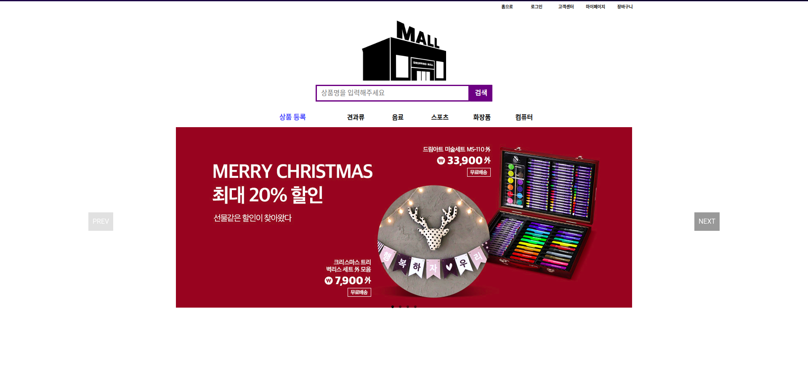

# Online Shopping Mall(front)

온라인 쇼핑몰 Web Application을 제작하였습니다.

## 구현한 기능

- 로그인
- 회원가입(항목별 중복확인)
- 상품 검색
- 상품 상세페이지
- 상품 가격순 정렬
- 상품 구매하기 페이지
- 장바구니 구매하기 페이지
- 카테고리
- 마이페이지
- 상품 추가
- 장바구니 추가 / 삭제

## 사용 기술

- ReactJS
- HTML
- styled-components
- webpack
- babel
- npm

## 배포

- Netlify

## 주의

- DB를 배포한 Atlas서버가 느려 처음 실행시 로딩시간이 5~6초정도 걸립니다.(서버 상황에 따라 달라질 수 있습니다)
